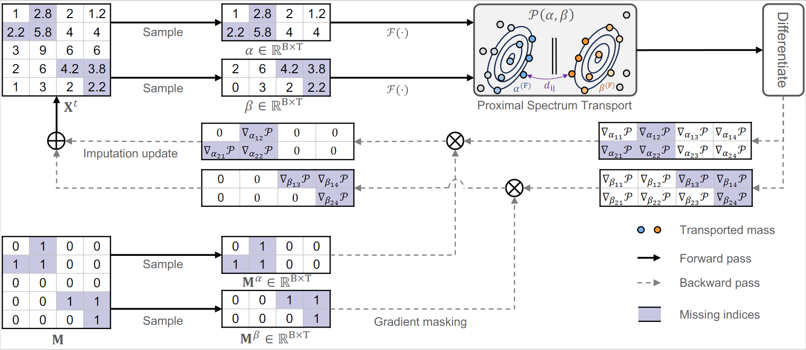

# PSW-I: Proximal Spectrum Wasserstein for Time-Series Imputation  

  

## Note

❗**Please note that the current code in this repository was temporarily uploaded during the rebuttal period. The final version of the code is still being cleaned up and will be released along with the experimental logs submitted before the paper’s final submission.**

This repository contains the implementation of **PSW-I**, a novel framework for robust and effective imputation of missing values in time-series data. The approach is built upon the **Proximal Spectrum Wasserstein (PSW)** discrepancy, tailored to address key challenges in time-series imputation.  


## Usage
```
bash scripts/illness.sh
```


## Abstract  
Missing data imputation through distribution alignment has demonstrated advantages for non-temporal datasets but exhibits suboptimal performance in time-series applications. The primary obstacle is crafting a discrepancy measure that simultaneously:  
1. Captures **temporal patterns**—accounting for periodicities and temporal dependencies inherent in time-series.  
2. Accommodates **non-stationarity**, ensuring robustness amidst multiple coexisting temporal patterns.  

In response to these challenges, we introduce the **Proximal Spectrum Wasserstein (PSW)** discrepancy based on the stochastic optimal transport framework. PSW integrates:  
- **Pairwise spectral distance** to encapsulate temporal patterns.  
- **Selective matching regularization** to accommodate non-stationarity.  

Building on PSW, we propose the **PSW-I** framework, which iteratively refines imputation results by minimizing the PSW discrepancy. Extensive experiments demonstrate that PSW-I effectively addresses these challenges and significantly outperforms prevailing time-series imputation methods.  

## Key Features  
- **Temporal Pattern Capturing**: Utilizes spectral distances to understand time-series periodicities and dependencies.  
- **Non-Stationarity Adaptation**: Incorporates selective matching for robustness across varied temporal patterns.  
- **Iterative Refinement**: Refines imputed values progressively for enhanced accuracy.  
- **Comprehensive Evaluation**: Outperforms state-of-the-art methods on multiple benchmark datasets.  


# 
